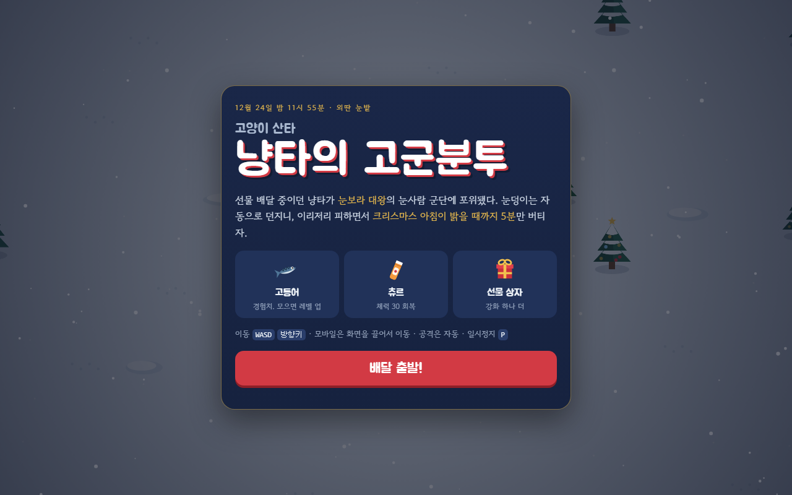
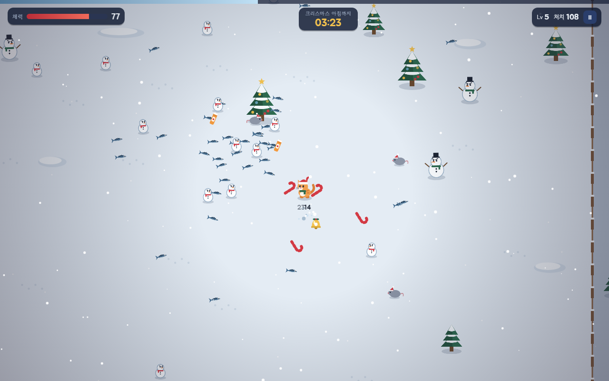

# 냥타의 고군분투

고양이 산타 "냥타"가 눈보라 대왕의 눈사람 군단 속에서 크리스마스 아침까지 5분을 버티는 서바이벌 브라우저 게임.

**▶ 플레이하기: https://kkangji99.github.io/nyanta-game/**

| 타이틀 | 플레이 |
|---|---|
|  |  |

빌드 없이 동작하는 정적 페이지입니다. `index.html`을 브라우저로 열면 바로 플레이할 수 있습니다.

## 파일 구성

- `index.html` — 화면 구조 (HUD, 타이틀·레벨업·일시정지·결과 화면)
- `style.css` — 스타일
- `js/` — 게임 스크립트 (`index.html`에서 아래 순서로 불러옴)
  - `config.js` — 조정값, 적 종류, 레벨업 강화 목록
  - `core.js` — 캔버스 준비, 공용 유틸리티
  - `sprites.js` — 캐릭터·아이템 그림과 스프라이트 캐시
  - `state.js` — 게임 상태 초기화
  - `input.js` — 키보드·터치 입력
  - `ui.js` — 타이틀·일시정지·레벨업·결과 화면, 최고 기록
  - `gameplay.js` — 적 생성, 공격, 충돌, 아이템 획득
  - `render.js` — 눈밭·울타리·나무·캐릭터·HUD 그리기
  - `main.js` — 게임 루프
- `screenshots/` — README용 스크린샷

## 조작

- 이동: `WASD` / 방향키 (모바일은 화면을 끌어서 이동)
- 공격: 자동 (가장 가까운 적에게 눈덩이)
- 일시정지: `P` / `Esc`
- 강화 선택: 카드 클릭 또는 `1`~`3`

## 집사 찬스

2분마다(2:00, 4:00) 집사가 도와주는 10초짜리 피버타임이 발동합니다.

- 받는 피해 없음(무적), 체력 20 회복
- 눈덩이 연사 속도 3배, 피해 1.5배, 이동 속도 1.3배
- 주변 고등어를 넓은 범위에서 끌어당김

## 아이템

| 아이템 | 효과 |
|---|---|
| 고등어 | 경험치. 모으면 레벨 업 (큰 적은 황금 고등어) |
| 츄르 | 체력 30 회복 |
| 선물 상자 | 강화 하나 추가 선택 |

## 적

- 성난 눈사람, 큰 눈사람
- 선물 도둑 쥐 — 1:40, 3:20, 4:00에 떼로 포위
- 눈보라 대왕 (보스) — 2:30, 4:30 등장, 얼음 조각 발사

## 조정값

`js/config.js`:

- `AW`, `AH` — 울타리 맵 반폭/반높이 (기본 820)
- `MAX_E` — 동시에 나오는 적 최대 수 (기본 80)
- `GAME_LEN` — 버텨야 하는 시간(초, 기본 300)
- `FEVER_EVERY`, `FEVER_LEN` — 집사 찬스 주기와 지속 시간(초, 기본 120 / 10)

> ES 모듈(`import`)은 `file://`로 열면 동작하지 않아서, 일반 `<script>`를 순서대로 불러오는 방식을 씁니다. 파일을 추가하면 `index.html`의 불러오는 순서도 맞춰 주세요.
